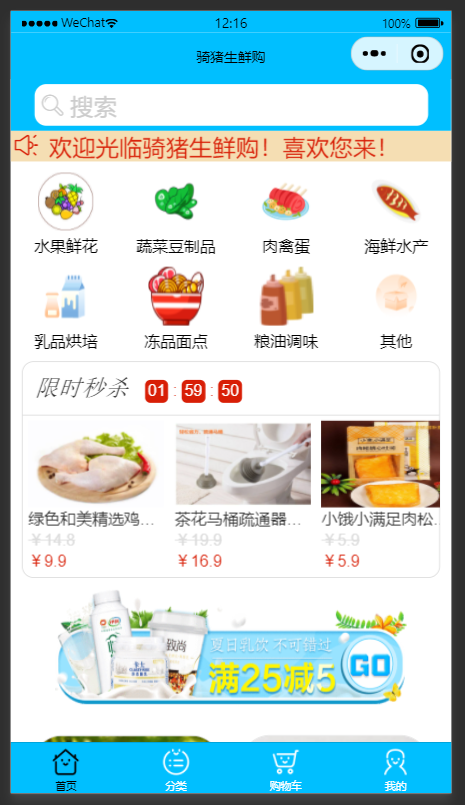

# 骑猪生鲜购

#### 介绍
一个便于人们生活购买生鲜产品的微信小程序。

#### 项目技术栈
Less、JavaScript、Es6、Node.js、Express、Vue2.js、E-charts等等

#### 项目截图

#### 项目描述
- 使用node.js和express写了简单的接口，监听MySQL数据库的数据;
- 微信小程序中用户可以对商品进行增删查，实现购物功能，也可以查询订单使用StorgeSync缓存技术存储订单信息;
- 后台管理系统登录中验证码使用svg-captcha 做验证码及验证以及实现简单的token验证;
- 后台管理系统中用户可以对商品进行增删改查，也可以添加管理员，修改密码等。
